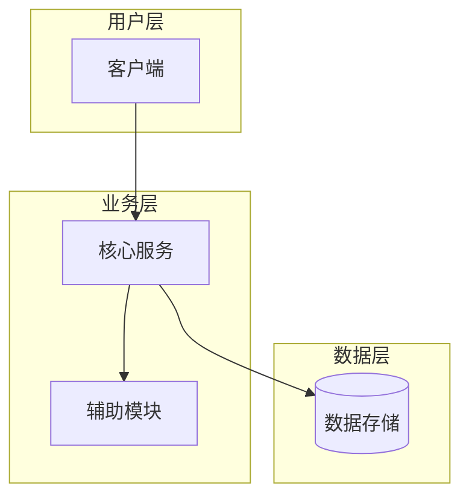
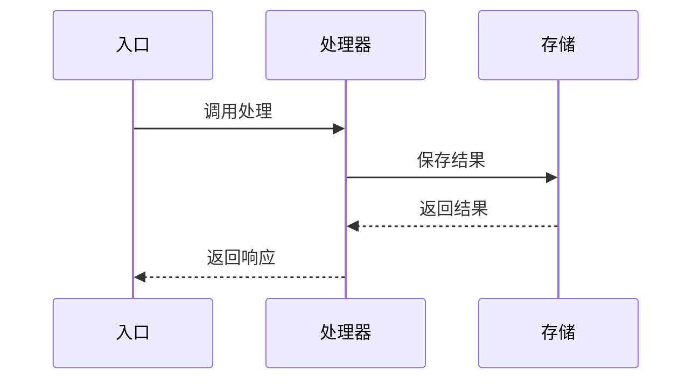
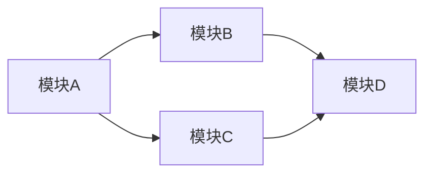
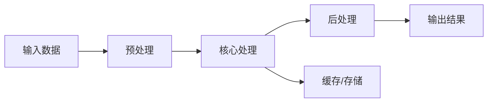

# 📖 项目技术文档: {项目名}

<!-- 
  使用说明：
  - 本模板由 Repo2Doc Skill 使用，基于代码分析自动填充
  - 所有 {占位符} 内容应替换为实际分析结果
  - 各章节的顺序和结构可根据具体项目调整
  - Mermaid 图表需遵循 docs/02-探索与分析策略.md 中的语法规范
-->

---

## 📋 项目概述

- **一句话介绍**: {这个项目是什么}
- **解决的问题**: {为什么需要这个项目，解决了什么痛点}
- **核心价值**: {它提供了什么独特的能力}
- **技术栈**: {使用的语言、框架、关键依赖}
- **项目状态**: {开发中 / 稳定版 / 维护模式}

---

## 🏗️ 系统架构

### 架构总览



### 核心组件说明

| 组件 | 职责 | 对应目录 |
|------|------|----------|
| {组件A} | {职责} | `src/componentA/` |
| {组件B} | {职责} | `src/componentB/` |
| {组件C} | {职责} | `src/componentC/` |

---

## 📁 代码结构详解

> 不只是列出目录，而是解释每个目录的职责和重要性

```
{project_name}/
├── src/                    # 🎯 源代码主目录
│   ├── core/               #    核心业务逻辑（从这里开始看！）
│   │   ├── engine.py       #    主引擎，处理 {核心业务}
│   │   └── processor.py    #    数据处理器
│   ├── api/                # 🌐 对外接口/路由定义
│   ├── models/             # 📊 数据模型定义
│   ├── services/           # ⚙️ 业务服务层
│   └── utils/              # 🔧 工具函数
├── tests/                  # 🧪 测试文件
├── config/                 # ⚙️ 配置文件
└── docs/                   # 📖 项目文档
```

---

## 🧩 核心模块深度解析

<!-- 对每个核心模块，重复使用以下模板 -->

### 模块: {模块名称}

**目录**: `src/{module}/`
**职责**: {一句话说明这个模块做什么}

**核心实现原理**:

{解释这个模块是如何工作的：
- 使用了什么技术或算法
- 核心的设计思路
- 为什么选择这种方案}

**关键文件**:

| 文件 | 作用 | 关键类/函数 |
|------|------|-------------|
| `{file1}.py` | {作用} | `{ClassName}`, `{function_name}()` |
| `{file2}.py` | {作用} | `{ClassName}` |

**代码调用流程**:



**如果要修改...**:
- 修改 {XX 功能}：去看 `{file}.py` 的 `{function}()` 方法
- 增加 {YY 功能}：在 `{module}/` 目录下添加新文件

---

<!-- 继续添加更多模块... -->

---

## 🔄 模块依赖关系



**依赖说明**:
- {模块A} 依赖 {模块B}：因为 {原因}
- {模块B} 依赖 {模块D}：因为 {原因}

---

## 📊 核心数据流



**数据流说明**:
1. {数据从哪里来}
2. {经过什么处理}
3. {最终到哪里去}

---

## 🔧 技术实现细节

### {功能/技术点 1}

**实现思路**: {解释怎么实现的}
**设计模式**: {使用了什么模式，如观察者、工厂、策略等}
**为什么这样设计**: {解释设计决策的原因}

### {功能/技术点 2}

**实现思路**: {解释}
**关键算法**: {如果有算法，简要说明}

---

## 🚀 新人上手指南

### 推荐的代码阅读顺序

1. **先看** `{入口文件}` — 理解程序如何启动
2. **再看** `{核心模块入口}` — 理解核心业务逻辑
3. **然后** `{数据模型}` — 理解数据结构
4. **接着** `{路由/API}` — 理解对外接口
5. **最后** `{工具函数}` — 了解辅助功能

### 如何运行项目

```bash
# 1. 安装依赖
{安装命令}

# 2. 配置环境
{配置步骤}

# 3. 启动项目
{启动命令}
```

### 如何调试

- **调试入口**: {从哪里开始打断点}
- **日志查看**: {日志在哪里}
- **常见问题**: {列出常见的启动/运行问题}

### 常见修改场景

| 修改需求 | 应该看的文件 | 注意事项 |
|----------|-------------|----------|
| {修改需求1} | `{文件路径}` | {注意事项} |
| {修改需求2} | `{文件路径}` | {注意事项} |
| {修改需求3} | `{文件路径}` | {注意事项} |

---

## 📌 待深入分析

> ⚠️ 以下部分需要进一步探索才能完善

- ⚠️ {待确认的内容1}
- ⚠️ {待确认的内容2}
- ⚠️ {待确认的内容3}
