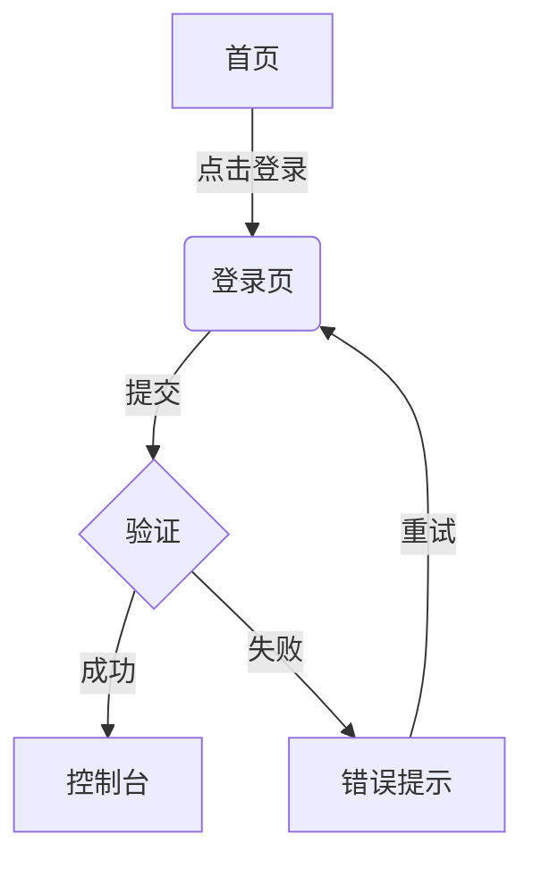
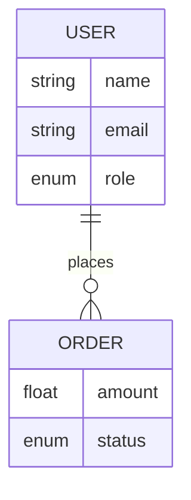

# 产品需求文档: {应用名称}

## 执行摘要

**产品**: {名称}
**类型**: {类型}
**目标用户**: {角色}
**核心价值**: {一句话}
**分析范围**: {N} 个页面模板，{K} 个角色，覆盖率 {X}%

---

## 用户角色

| 角色 | 描述 | 关键能力 |
|------|------|----------|
| {角色} | {描述} | {操作} |

---

## 功能模块

<!-- 按用户目标分组，不按技术分层 -->

### 模块一: {用户目标}

#### FR-001: {功能标题}

**优先级**: P{0|1|2} | **置信度**: 🟢/🟡/🔴
**证据**: `screenshots/page-{NN}-{label}.png` (NODE-{NNN})

> 作为{角色}，我可以{操作}，从而{价值}。

**验收标准**:
- Given {前置} / When {操作} / Then {结果}

**待确认** *(Medium/Low)*: {问题}

---

### 模块二: {用户目标}

<!-- 继续添加 FR -->

---

## 核心业务流程

<!-- 从 state-graph 的 Edges 表派生，每个关键流程一个 Mermaid 图 -->

### 流程 1: {流程名称}

**描述**: {一句话}
**涉及角色**: {角色}
**相关 FR**: FR-{NNN}, FR-{NNN}

---

## 数据模型

<!-- 从 state-graph 的 Data Entities 派生 -->

### 实体详情

| 实体 | 字段 | 类型 | 必填 | 来源 |
|------|------|------|------|------|
| {Entity} | {field} | {type} | {是/否} | NODE-{NNN} |

---

## 非功能需求

| 维度 | 信号 | 需求 |
|------|------|------|
| 性能 | {信号} | {需求} |
| 安全 | {信号} | {需求} |
| 国际化 | {信号} | {需求} |
| 响应式 | {信号} | {需求} |

---

## 待确认问题

| ID | 问题 | 相关 FR | 置信度影响 | 建议方式 |
|----|------|---------|-----------|----------|
| Q-001 | {问题} | FR-{NNN} | {影响} | {方式} |
