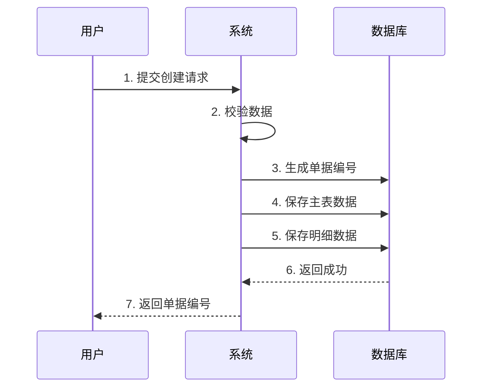
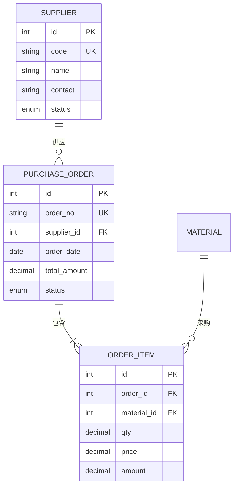
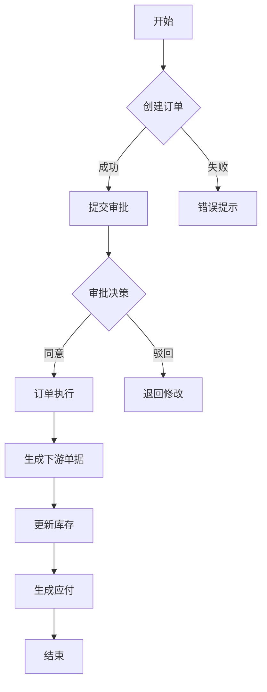

# 业务需求文档: {项目名称}

> 📋 **文档说明**
> - 本文档面向业务人员，从代码逆向分析得出系统功能、数据结构、业务规则
> - 🟢 = 代码明确实现 | 🟡 = 推断得出 | 🔴 = 待确认
> - 所有字段定义包含：类型、长度、必填、校验规则、业务含义

---

## 一、系统概览

### 1.1 系统定位

**系统名称**: {项目名称}
**业务类型**: {ERP/CRM/OA 等}
**服务对象**: {主要用户群体}
**核心价值**: {一句话说明系统解决什么业务问题}
**技术架构**: {前后端技术栈}

### 1.2 核心业务模块

| 模块 | 业务职责 | 核心实体 | 代码入口 | 置信度 |
|------|---------|---------|---------|--------|
| {模块名} | {职责} | {实体列表} | `src/module/` | 🟢 |

---

## 二、业务模块详细说明

<!-- 按业务域组织，每个模块包含：功能清单、数据模型、业务规则、API接口 -->

### 模块一: {业务模块名称}

#### 2.1.1 模块概述

**业务目标**: {模块解决什么业务问题}
**核心实体**: {实体列表}
**涉及角色**: {角色列表}
**关联模块**: {上下游模块}
**代码目录**: `src/{module}/`

#### 2.1.2 功能清单

| 功能编号 | 功能名称 | 业务说明 | API接口 | 操作角色 | 优先级 | 置信度 |
|---------|---------|---------|---------|---------|--------|--------|
| {模块}-001 | {功能} | {说明} | POST /api/xxx | {角色} | P0 | 🟢 |

#### 2.1.3 数据模型

##### 实体: {实体名称} ({table_name})

**业务含义**: {实体在业务中的含义}
**数据来源**: {数据从哪里来，手工录入/系统生成/外部导入}
**状态流转**: {状态变化流程}
**代码位置**: `src/models/{entity}.py` 或 `src/entities/{entity}.ts`

**字段定义**:

| 字段名 | 字段标签 | 数据类型 | 长度 | 必填 | 默认值 | 校验规则 | 业务含义 | 代码位置 | 置信度 |
|--------|---------|---------|------|------|--------|---------|---------|---------|--------|
| id | 主键 | integer | - | 是 | 自增 | 主键 | 唯一标识 | `models.py:15` | 🟢 |
| order_no | 单据编号 | string | 20 | 是 | 自动生成 | 唯一，格式规则 | 业务单号 | `models.py:18` | 🟢 |
| order_date | 单据日期 | date | - | 是 | 当前日期 | ≤ 当前日期 | 业务发生日期 | `models.py:20` | 🟢 |
| total_amount | 总金额 | decimal | (12,2) | 是 | 计算得出 | ≥ 0 | 业务金额 | `models.py:25` | 🟢 |
| status | 状态 | enum | - | 是 | 草稿 | 枚举值列表 | 流程控制 | `models.py:30` | 🟢 |
| created_at | 创建时间 | datetime | - | 是 | 当前时间 | - | 审计字段 | `models.py:35` | 🟢 |
| updated_at | 更新时间 | datetime | - | 否 | - | - | 审计字段 | `models.py:36` | 🟢 |

**数据库约束**:

```sql
-- 主键
PRIMARY KEY (id)

-- 唯一约束
UNIQUE INDEX idx_order_no (order_no)

-- 外键约束
FOREIGN KEY (supplier_id) REFERENCES supplier(id) ON DELETE RESTRICT

-- 索引
INDEX idx_order_date (order_date)
INDEX idx_status (status)
```

**关联关系**:

| 关系类型 | 关联实体 | 关联字段 | 关联说明 | 代码位置 | 置信度 |
|---------|---------|---------|---------|---------|--------|
| 属于 (N:1) | supplier | supplier_id | 采购订单属于供应商 | `models.py:22` | 🟢 |
| 包含 (1:N) | order_item | order_id | 订单包含多个明细 | `models.py:40` | 🟢 |
| 关联 (N:M) | material | 通过 order_item | 订单关联物料 | - | 🟢 |

**ORM 定义示例**:

```python
# src/models/purchase_order.py
class PurchaseOrder(Base):
    __tablename__ = 'purchase_order'

    id = Column(Integer, primary_key=True, autoincrement=True)
    order_no = Column(String(20), unique=True, nullable=False)
    order_date = Column(Date, nullable=False, default=date.today)
    supplier_id = Column(Integer, ForeignKey('supplier.id'), nullable=False)
    total_amount = Column(Numeric(12, 2), nullable=False)
    status = Column(Enum('草稿', '待审批', '已审批', '已执行'), nullable=False)

    # 关联关系
    supplier = relationship('Supplier', back_populates='orders')
    items = relationship('PurchaseOrderItem', back_populates='order', cascade='all, delete-orphan')
```

#### 2.1.4 业务规则

| 规则编号 | 规则名称 | 触发时机 | 规则说明 | 代码位置 | 置信度 |
|---------|---------|---------|---------|---------|--------|
| BR-{模块}-001 | {规则名} | {时机} | {规则描述} | `services/xxx.py:50` | 🟢 |

**规则实现代码**:

```python
# src/services/purchase_service.py:50
def calculate_total_amount(order_id):
    """计算订单总金额 = sum(明细.数量 * 明细.单价)"""
    items = OrderItem.query.filter_by(order_id=order_id).all()
    total = sum(item.qty * item.price for item in items)
    return total
```

#### 2.1.5 API 接口

| 接口路径 | 方法 | 功能 | 请求参数 | 返回数据 | 权限 | 代码位置 | 置信度 |
|---------|------|------|---------|---------|------|---------|--------|
| /api/orders | GET | 查询订单列表 | page, size, filters | 订单列表 | order:view | `views.py:20` | 🟢 |
| /api/orders | POST | 创建订单 | 订单数据 | 订单ID | order:create | `views.py:45` | 🟢 |
| /api/orders/:id | GET | 查询订单详情 | id | 订单详情 | order:view | `views.py:80` | 🟢 |
| /api/orders/:id | PUT | 更新订单 | id, 订单数据 | 更新结果 | order:edit | `views.py:110` | 🟢 |
| /api/orders/:id | DELETE | 删除订单 | id | 删除结果 | order:delete | `views.py:150` | 🟢 |

**接口实现示例**:

```python
# src/views/order_view.py
@api.route('/api/orders', methods=['POST'])
@permission_required('order:create')
def create_order():
    """创建采购订单"""
    data = request.get_json()

    # 业务校验
    if not validate_order_data(data):
        return jsonify({'error': '数据校验失败'}), 400

    # 生成订单编号
    order_no = generate_order_no()

    # 保存订单
    order = PurchaseOrder.create(
        order_no=order_no,
        order_date=data['order_date'],
        supplier_id=data['supplier_id'],
        total_amount=calculate_total(data['items']),
        status='草稿'
    )

    return jsonify({'id': order.id, 'order_no': order.order_no}), 201
```

#### 2.1.6 业务流程

##### 流程: {流程名称}

**业务场景**: {什么场景下触发此流程}
**前置条件**: {开始前必须满足的条件}
**后置结果**: {流程结束后的状态}



**代码调用链**:

```
views.py:create_order()
  → services.py:validate_order_data()
  → services.py:generate_order_no()
  → models.py:PurchaseOrder.create()
  → models.py:OrderItem.bulk_create()
```

---

## 三、数据实体关系

### 3.1 ER 图



### 3.2 数据字典

<!-- 所有枚举值、状态码的详细说明 -->

| 实体 | 字段 | 枚举值 | 值含义 | 使用场景 | 置信度 |
|------|------|--------|--------|---------|--------|
| purchase_order | status | 草稿 | 新建未提交 | 可编辑删除 | 🟢 |
| purchase_order | status | 待审批 | 已提交审批 | 等待审批 | 🟢 |
| purchase_order | status | 已审批 | 审批通过 | 可执行业务 | 🟢 |
| purchase_order | status | 已驳回 | 审批不通过 | 退回修改 | 🟢 |
| purchase_order | status | 已完成 | 业务完成 | 归档状态 | 🟢 |

---

## 四、跨模块业务流程

### 4.1 完整业务流程图



**涉及的模块调用**:

| 步骤 | 调用模块 | 调用函数 | 代码位置 | 置信度 |
|-----|---------|---------|---------|--------|
| 创建订单 | purchase | create_order() | `purchase/views.py:45` | 🟢 |
| 提交审批 | workflow | submit_approval() | `workflow/services.py:20` | 🟢 |
| 审批通过 | workflow | approve() | `workflow/services.py:50` | 🟢 |
| 生成入库单 | inventory | create_inbound() | `inventory/services.py:30` | 🟡 |
| 更新库存 | inventory | update_stock() | `inventory/services.py:80` | 🟡 |
| 生成应付 | finance | create_payable() | `finance/services.py:25` | 🟡 |

---

## 五、权限与安全

### 5.1 角色权限矩阵

| 角色 | 模块 | 查看 | 创建 | 编辑 | 删除 | 审批 | 代码位置 | 置信度 |
|------|------|------|------|------|------|------|---------|--------|
| 采购员 | 采购订单 | ✓ | ✓ | ✓ | ✓ | ✗ | `permissions.py:20` | 🟢 |
| 采购经理 | 采购订单 | ✓ | ✓ | ✓ | ✗ | ✓ | `permissions.py:25` | 🟢 |
| 库管员 | 采购订单 | ✓ | ✗ | ✗ | ✗ | ✗ | `permissions.py:30` | 🟢 |

### 5.2 数据权限规则

| 角色 | 数据范围 | 实现方式 | 代码位置 | 置信度 |
|------|---------|---------|---------|--------|
| 采购员 | 本部门数据 | WHERE dept_id = current_user.dept_id | `filters.py:15` | 🟡 |
| 采购经理 | 全公司数据 | 无过滤条件 | - | 🟢 |
| 库管员 | 所负责仓库 | WHERE warehouse_id IN (user.warehouses) | `filters.py:30` | 🟡 |

---

## 六、非功能需求

### 6.1 性能要求

| 接口 | 响应时间 | 并发数 | 实现方式 | 代码位置 | 置信度 |
|------|---------|--------|---------|---------|--------|
| 列表查询 | < 2s | 50 | 分页查询 + 索引 | `views.py:20` | 🟡 |
| 详情查询 | < 1s | 100 | ORM关联加载 | `views.py:80` | 🟢 |
| 数据保存 | < 1s | 30 | 事务批量提交 | `services.py:50` | 🟢 |

### 6.2 数据安全

| 安全措施 | 实现方式 | 涉及数据 | 代码位置 | 置信度 |
|---------|---------|---------|---------|--------|
| 数据加密 | AES加密敏感字段 | 价格、金额 | `crypto.py:10` | 🟡 |
| 操作审计 | 记录操作日志 | 所有增删改 | `audit.py:15` | 🟢 |
| SQL注入防护 | ORM参数化查询 | 所有查询 | `models.py` | 🟢 |

---

## 七、待确认问题

| 问题ID | 问题描述 | 影响范围 | 代码位置 | 建议确认方式 | 优先级 |
|--------|---------|---------|---------|-------------|--------|
| Q-001 | 审批流程是否支持多级审批？ | workflow/services.py:50 | 审批逻辑 | 确认业务需求 | P0 |
| Q-002 | 订单金额计算是否含税？ | models.py:25 | 金额字段 | 确认财务规则 | P1 |
| Q-003 | 超收比例是否可配置？ | services.py:80 | 入库校验 | 确认业务规则 | P1 |

---

## 八、技术实现细节

### 8.1 核心算法

#### 算法: 订单金额计算

**业务规则**: 订单总金额 = sum(明细.数量 × 明细.单价)

**实现代码**:

```python
# src/services/order_service.py:50
def calculate_total_amount(order_id: int) -> Decimal:
    """
    计算订单总金额

    Args:
        order_id: 订单ID

    Returns:
        订单总金额（含税）

    Business Rules:
        1. 汇总所有明细行的金额
        2. 明细金额 = 数量 × 单价
        3. 保留两位小数
    """
    items = OrderItem.query.filter_by(order_id=order_id).all()
    total = sum(item.qty * item.price for item in items)
    return round(total, 2)
```

### 8.2 数据一致性保证

| 一致性要求 | 实现方式 | 代码位置 | 置信度 |
|-----------|---------|---------|--------|
| 主从表一致性 | 数据库事务 | `services.py:50` | 🟢 |
| 库存准确性 | 乐观锁 + 事务 | `inventory.py:80` | 🟡 |
| 单据编号唯一性 | 数据库唯一约束 | `models.py:18` | 🟢 |

---

## 附录

### A. 代码结构

```
src/
├── models/              # 数据模型定义
│   ├── purchase_order.py
│   ├── order_item.py
│   └── supplier.py
├── views/               # API 接口
│   └── order_view.py
├── services/            # 业务逻辑
│   ├── order_service.py
│   └── workflow_service.py
├── utils/               # 工具函数
│   ├── crypto.py
│   └── audit.py
└── config/              # 配置文件
    └── permissions.py
```

### B. 数据库迁移

```sql
-- 创建采购订单表
CREATE TABLE purchase_order (
    id INT AUTO_INCREMENT PRIMARY KEY,
    order_no VARCHAR(20) UNIQUE NOT NULL,
    order_date DATE NOT NULL,
    supplier_id INT NOT NULL,
    total_amount DECIMAL(12,2) NOT NULL,
    status ENUM('草稿', '待审批', '已审批', '已执行') NOT NULL,
    created_at DATETIME NOT NULL DEFAULT CURRENT_TIMESTAMP,
    updated_at DATETIME ON UPDATE CURRENT_TIMESTAMP,

    FOREIGN KEY (supplier_id) REFERENCES supplier(id) ON DELETE RESTRICT
);

-- 创建索引
CREATE INDEX idx_order_date ON purchase_order(order_date);
CREATE INDEX idx_status ON purchase_order(status);
```

### C. 依赖关系

| 模块 | 依赖模块 | 依赖原因 | 代码位置 | 置信度 |
|------|---------|---------|---------|--------|
| purchase | supplier | 订单关联供应商 | `models.py:22` | 🟢 |
| purchase | inventory | 订单生成入库单 | `services.py:80` | 🟡 |
| purchase | finance | 订单生成应付单 | `services.py:90` | 🟡 |