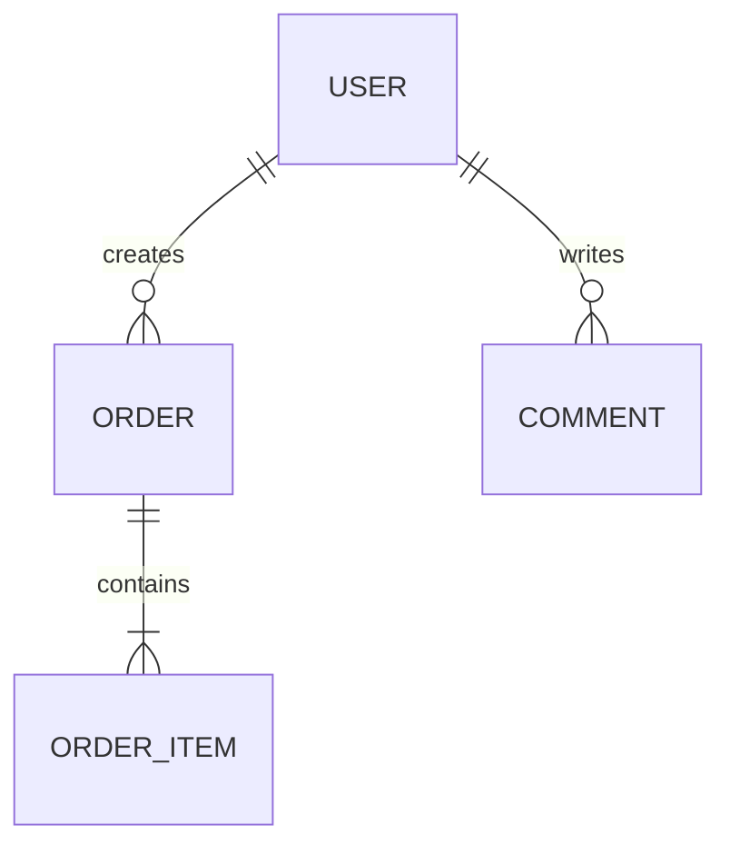

# 状态图: {应用名称}

**URL**: {url}
**应用类型**: {SaaS / 管理后台 / 电商 / 内容平台 / 工具站 / 社区 / 未知}
**探索日期**: {YYYY-MM-DD}
**页面节点**: {N}
**虚拟视图**: {M}
**流程数**: {K}
**需要认证**: {是 / 否 / 部分}
**覆盖率**: {N}%

---

## 一、信息架构

### 1.1 顶层导航

| 序号 | 名称 | 路由/入口 | 类型 | 状态 |
|------|------|----------|------|------|
| 1 | {首页} | {/} | 导航 | ✅ |
| 2 | {模块A} | {/module-a} | 导航 | ✅ |

### 1.2 次级导航 / 关键入口

| 上级 | 名称 | 路由/动作 | 页面类型 |
|------|------|----------|---------|
| {模块A} | {列表页} | {/module-a/list} | List |
| {首页} | {立即开始} | 点击 CTA | Flow |

---

## 二、页面节点

> 节点类型：Landing / List / Detail / Form / Dashboard / Auth / Settings / Search / Error / Success / Other

### NODE-001: {页面名称}

- **URL**: {/path}
- **类型**: {节点类型}
- **所属模块**: {模块名称}
- **认证要求**: {匿名可见 / 登录后 / 特定权限}
- **截图**: `screenshots/page-001-{label}.png`

**页面目标**: {一句话描述该页面的业务目的}

**布局结构**:
- Header: {说明}
- Sidebar: {说明}
- Main: {说明}
- Footer: {说明}

**关键元素**:
- LINK: "{文本}" → NODE-{NNN}
- BUTTON: "{文本}" → {动作/目标}
- FORM: "{表单名}" → fields: {field1}, {field2}
- TAB: "{名称}" → VVIEW-{NNN}
- MODAL_TRIGGER: "{文本}" → VVIEW-{NNN}

**状态信号**:
- 状态值: {draft / pending / done / failed}
- 反馈: {toast / loading / empty / error}
- 权限差异: {说明}

**数据线索**:
- {entity}.{field}: {type}
- 枚举: {field} = [{value1}, {value2}]

**备注**: {补充说明}

---

### NODE-002: {页面名称}

<!-- 同上格式扩展 -->

---

## 三、虚拟视图

> 虚拟视图指不单独变化 URL、但需要单独建模的界面状态。

### VVIEW-001: {名称}

- **父节点**: NODE-{NNN}
- **触发方式**: {点击按钮 / Tab 切换 / Hover / 自动出现}
- **类型**: {Modal / Drawer / Tab / Dropdown / Step / Popover}
- **截图**: `screenshots/page-{NNN}-{label}.png`

**内容摘要**: {该视图展示了什么、支持什么操作}

**包含要素**:
- 字段: {field1}, {field2}
- 按钮: {button1}, {button2}
- 状态: {说明}

---

## 四、跳转关系

| 来源 | 动作 | 目标 | 条件/结果 |
|------|------|------|-----------|
| NODE-001 | 点击 "{文本}" | NODE-002 | — |
| NODE-002 | 提交表单 | NODE-003 | 表单校验通过 |
| NODE-002 | 点击 "取消" | NODE-001 | 返回上一页 |
| NODE-003 | 打开 Tab "{名称}" | VVIEW-001 | 局部状态切换 |

---

## 五、认证与权限边界

| 节点/流程 | 访问条件 | 现象 | 影响 |
|----------|---------|------|------|
| NODE-010 | 登录后 | 未登录跳转登录页 | 匿名无法访问 |
| NODE-021 | 管理员权限 | 按钮隐藏 | 无法确认高级操作 |

---

## 六、关键流程图

### 6.1 主流程：{流程名称}

```mermaid
flowchart TD
    A[NODE-001 {入口}] --> B[NODE-002 {中间页}]
    B --> C[VVIEW-001 {弹窗/步骤}]
    C --> D[NODE-003 {结果页}]
```

### 6.2 状态流转：{对象名称}

```mermaid
stateDiagram-v2
    [*] --> {初始状态}
    {初始状态} --> {处理中状态}: {触发动作}
    {处理中状态} --> {成功状态}: {成功条件}
    {处理中状态} --> {失败状态}: {失败条件}
```

---

## 七、角色与入口映射

| 角色/用户态 | 可见入口 | 关键能力 | 备注 |
|------------|---------|---------|------|
| 匿名用户 | {首页, 登录, 注册} | {浏览公开内容} | {说明} |
| 登录用户 | {个人中心, 业务模块} | {提交/管理/查看} | {说明} |
| 管理员 | {配置/后台入口} | {高级管理操作} | {说明} |

---

## 八、关键实体与关系线索

### {实体名}
**来源**: NODE-{NNN}
```text
id: string
{name}: string
{status}: enum(...)
{created_at}: datetime?
```
**说明**: {该实体在业务中的含义}

### 实体关系



---

## 九、错误态与边界态

| 节点/场景 | 类型 | 表现 | 是否已截图 |
|----------|------|------|-----------|
| NODE-004 | Empty | 列表无数据提示 | 是 |
| NODE-008 | ValidationError | 表单字段报错 | 是 |
| NODE-011 | AuthError | 无权限提示 | 是/否 |
| NODE-013 | NotFound | 404 页面 | 是/否 |

---

## 十、跳过与阻断

| 对象 | 原因 | 影响 | 处理 |
|------|------|------|------|
| {/path} | DUPLICATE_TEMPLATE | 无新增信息 | 已跳过 |
| {管理员页面} | AUTH-GATED | 无法确认配置模块 | 等待账号/权限 |
| {支付流程} | CAPTCHA | 无法自动继续 | 等待人工协助 |

---

## 十一、覆盖率摘要

**总体覆盖率**: {N}%

| 维度 | 状态 | 说明 |
|------|------|------|
| 导航覆盖 | ✅/⚠️/❌ | {顶层 N/M，次级 K/L} |
| 页面模板覆盖 | ✅/⚠️/❌ | {说明} |
| 流程覆盖 | ✅/⚠️/❌ | {说明} |
| 表单覆盖 | ✅/⚠️/❌ | {说明} |
| 弹窗/局部状态覆盖 | ✅/⚠️/❌ | {说明} |
| 错误/空态覆盖 | ✅/⚠️/❌ | {说明} |
| 权限边界覆盖 | ✅/⚠️/❌ | {说明} |

---

## 十二、结论

- **主要信息架构已确认**: {是/否/部分}
- **主业务链路是否走通**: {是/否/部分}
- **仍需补充的节点**: {列表}
- **可直接进入 PRD 生成的程度**: {高/中/低}
