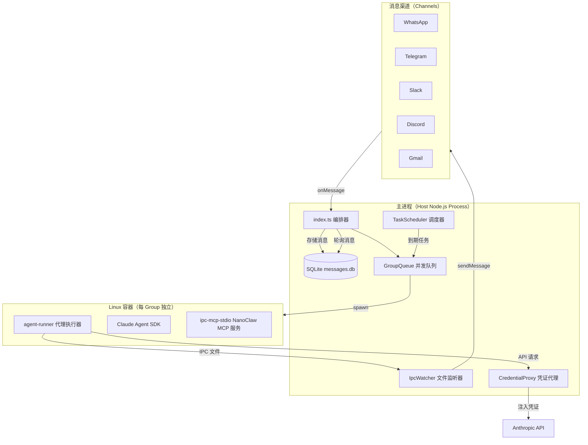
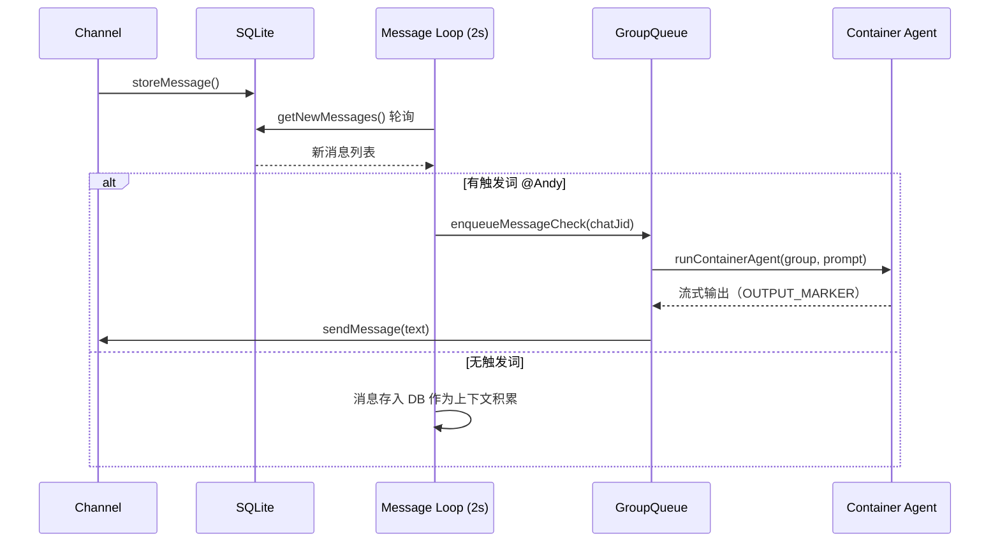
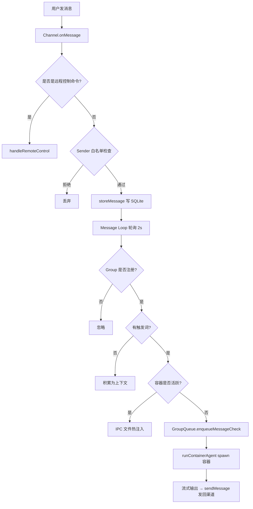

# 📖 项目技术文档: NanoClaw

---

## 📋 项目概述

- **一句话介绍**: NanoClaw 是一个轻量级个人 Claude AI 助手，让 AI 代理在隔离容器中安全运行，通过消息平台（WhatsApp/Telegram/Slack/Discord 等）与用户交互。
- **解决的问题**: 现有方案（如 OpenClaw）代码庞大（50 万行）、依赖众多，安全隔离仅在应用层，无法真正信任 AI 代理的操作范围。NanoClaw 用极少量代码（约 3500 行核心代码）实现相同功能，代理运行在 Linux 容器（OS 级隔离），而非仅靠权限检查。
- **核心价值**: 小到可读懂的代码库、容器级安全隔离、支持多渠道消息、内置调度系统、通过 Skill 机制可扩展而不膨胀主干。
- **技术栈**: Node.js 20+ / TypeScript、SQLite（better-sqlite3）、Docker / Apple Container、Anthropic Claude Agent SDK、Pino 日志、Vitest 测试
- **项目状态**: 稳定版（v1.2.21），MIT 许可

---

## 🏗️ 系统架构

### 架构总览



### 核心组件说明

| 组件 | 职责 | 对应文件 |
|------|------|----------|
| 编排器 | 状态管理、消息轮询、协调所有子系统启动 | `src/index.ts` |
| 渠道注册表 | 工厂模式管理多渠道，自注册模式 | `src/channels/registry.ts` |
| GroupQueue | 每 Group 消息/任务并发控制，含指数退避重试 | `src/group-queue.ts` |
| ContainerRunner | 构建 volume 挂载参数、spawn 容器进程、解析流式输出 | `src/container-runner.ts` |
| IPC Watcher | 轮询容器产出的 JSON 文件（消息/任务操作） | `src/ipc.ts` |
| TaskScheduler | 每分钟检查到期任务，放入 GroupQueue 执行 | `src/task-scheduler.ts` |
| CredentialProxy | HTTP 代理服务，将容器 API 请求的 placeholder 凭证替换为真实凭证 | `src/credential-proxy.ts` |
| DB | SQLite 封装，管理消息、Groups、Sessions、Tasks | `src/db.ts` |
| AgentRunner | 容器内运行，接收 stdin 指令，调用 Claude Agent SDK，结果写 stdout | `container/agent-runner/src/index.ts` |

---

## 📁 代码结构详解

```
nanoclaw/
├── src/                        # 🎯 主进程源码
│   ├── index.ts                #    ⭐ 入口/编排器，从这里开始读
│   ├── channels/
│   │   ├── registry.ts         #    渠道工厂注册表
│   │   └── index.ts            #    桶导入（触发渠道自注册）
│   ├── container-runner.ts     #    构建容器启动参数、spawn 容器、解析输出
│   ├── container-runtime.ts    #    检测 Docker/Apple Container 运行时
│   ├── group-queue.ts          #    Group 并发控制队列
│   ├── ipc.ts                  #    IPC 文件监听（容器 → 主进程通信）
│   ├── task-scheduler.ts       #    定时任务调度循环
│   ├── db.ts                   #    SQLite CRUD 操作
│   ├── credential-proxy.ts     #    HTTP 代理：凭证注入
│   ├── router.ts               #    消息格式化和出站路由
│   ├── config.ts               #    全局常量（轮询间隔、路径、触发词等）
│   ├── types.ts                #    TypeScript 接口（Channel、RegisteredGroup 等）
│   ├── logger.ts               #    Pino 日志实例
│   ├── mount-security.ts       #    附加挂载路径白名单验证
│   └── sender-allowlist.ts     #    发送者白名单控制
│
├── container/
│   ├── Dockerfile              #    容器镜像（基于 node，含 Claude Code CLI）
│   ├── build.sh                #    镜像构建脚本
│   ├── agent-runner/src/
│   │   ├── index.ts            #    容器内主程序：读 stdin → 调 SDK → 写 stdout
│   │   └── ipc-mcp-stdio.ts    #    NanoClaw MCP 服务（stdio 协议，供 SDK 调用）
│   └── skills/                 #    容器内置 Skill（agent-browser 等）
│
├── groups/                     #    每 Group 的工作目录和记忆文件
│   ├── global/CLAUDE.md        #    全局记忆（所有 Group 只读）
│   └── {channel}_{group}/
│       ├── CLAUDE.md           #    Group 专属记忆
│       └── logs/               #    容器运行日志
│
├── store/                      #    运行时数据（gitignored）
│   └── messages.db             #    SQLite 数据库
│
├── data/                       #    应用状态（gitignored）
│   ├── sessions/               #    每 Group 的 Claude 会话数据
│   └── ipc/                    #    容器 IPC 文件交换目录
│
├── setup/                      #    首次安装向导（TypeScript）
└── .claude/skills/             #    Claude Code Skill 集合
```

---

## 🧩 核心模块深度解析

### 模块：渠道系统（Channel System）

**目录**: `src/channels/`
**职责**: 抽象多种消息平台（WhatsApp/Telegram/Slack 等），提供统一接口

**核心实现原理**:

采用**自注册工厂模式**。每个渠道实现 `Channel` 接口并在模块加载时调用 `registerChannel()`：

```typescript
// 渠道接口（src/types.ts）
interface Channel {
  name: string;
  connect(): Promise<void>;
  sendMessage(jid: string, text: string): Promise<void>;
  isConnected(): boolean;
  ownsJid(jid: string): boolean;        // 判断某个 JID 属于哪个渠道
  disconnect(): Promise<void>;
  setTyping?(jid: string, isTyping: boolean): Promise<void>;
  syncGroups?(force: boolean): Promise<void>;
}
```

**工厂注册流程**:
1. Skill（如 `/add-whatsapp`）在 `src/channels/` 下添加文件，文件 load 时调用 `registerChannel('whatsapp', factory)`
2. `src/channels/index.ts` 用桶导入触发所有渠道注册
3. 主进程启动时遍历注册表，调用工厂函数；工厂返回 `null` 表示凭证缺失，跳过

**关键设计**: 核心代码无需了解任何具体渠道实现，渠道以 Skill 形式按需安装，核心保持最小。

**关键文件**:

| 文件 | 作用 | 关键导出 |
|------|------|---------|
| `src/channels/registry.ts` | 工厂注册表（Map） | `registerChannel()`, `getChannelFactory()` |
| `src/channels/index.ts` | 桶导入触发注册 | — |
| `src/types.ts` | Channel 接口定义 | `Channel`, `ChannelOpts`, `NewMessage` |

---

### 模块：消息流水线（Message Pipeline）

**文件**: `src/index.ts`
**职责**: 从消息入站到 Agent 响应的完整流水线

**核心数据流**:



**关键机制 — 对话追赶（Conversation Catch-Up）**:

当触发消息到达时，Agent 不只获得触发消息，而是获得自上次 Agent 交互以来 **所有** 消息（含非触发消息）。这使 Agent 能理解群聊的完整上下文，而不仅是被 `@Andy` 的那条消息。

**关键机制 — 热路径（容器复用）**:

若同 Group 的容器仍在运行（`GroupQueue.sendMessage()` 返回 `true`），后续消息通过 IPC 文件注入活跃容器，避免重新 spawn，显著降低延迟。

---

### 模块：容器运行（Container Runner）

**文件**: `src/container-runner.ts`
**职责**: 构建容器启动参数、管理 Volume 挂载、解析流式输出

**Volume 挂载策略**:

| Group 类型 | 挂载内容 |
|-----------|---------|
| 普通 Group | `/workspace/group`（可写）、`/workspace/global`（只读）、`.claude/`（会话）、`ipc/`（IPC）|
| Main Group | 额外挂载 `/workspace/project`（项目根，只读）、`.env` 被 `/dev/null` 遮盖 |

**安全设计**: 容器内永远不存在真实 API 密钥。`container-runner.ts` 注入的是 placeholder 值（`ANTHROPIC_API_KEY=placeholder`），实际请求经由 `credential-proxy` 转发时注入真实凭证。

**流式输出协议**:

```
Host (stdout 监听)                    Container (stdout 写入)
       ←── ---NANOCLAW_OUTPUT_START---
       ←── {"status":"success","result":"Andy: 你好！"}
       ←── ---NANOCLAW_OUTPUT_END---
```

每个 marker 对对应一次 Agent 结果，主进程实时解析并调用 `channel.sendMessage()`。

---

### 模块：IPC 通信（IPC Watcher）

**文件**: `src/ipc.ts`
**职责**: 处理容器发起的操作请求（发消息、创建/管理任务、注册 Group）

**架构**: 基于文件系统的 IPC，避免网络端口或复杂协议：

```
data/ipc/{group_folder}/
├── messages/   ← 容器写入，主进程读取并转发到渠道
├── tasks/      ← 容器写入任务操作（创建/暂停/取消等）
└── input/      ← 主进程写入，容器读取（follow-up 消息、_close 哨兵）
```

**安全授权**:
- IPC 文件所在目录名就是 Group 身份凭证（`{group_folder}/`）
- 非 main Group 的容器只能向自己的 `chatJid` 发消息
- 只有 main Group 可以注册新 Group、刷新 Group 列表、跨 Group 调度任务

---

### 模块：凭证代理（Credential Proxy）

**文件**: `src/credential-proxy.ts`
**职责**: 在主机上运行 HTTP 代理，拦截容器的 Anthropic API 请求，注入真实凭证

**工作原理**:

```
Container (placeholder token)
    │ HTTP → host_gateway:port
    ▼
Credential Proxy
    │ 替换 x-api-key 或 Authorization
    ▼
Anthropic API (真实凭证)
```

支持两种认证模式：
- **API Key 模式**: 每个请求注入 `x-api-key`
- **OAuth 模式**: 仅在容器发起 token 交换请求时注入 Bearer token，后续请求携带临时 API key 直接通过

这确保容器即使被恶意 prompt 注入也无法窃取 API 密钥。

---

### 模块：调度器（Task Scheduler）

**文件**: `src/task-scheduler.ts`
**职责**: 每 60 秒扫描到期任务，通过 GroupQueue 以容器形式执行

**调度类型**:
- `cron`: 使用 cron-parser 解析，按用户时区计算下次运行
- `interval`: 锚定到原定时间计算（防止累积漂移）
- `once`: 运行一次后自动标记 completed

**context_mode**:
- `isolated`（默认）: 任务在新会话中运行，无历史上下文
- `group`: 复用 Group 的当前会话 session_id，有完整对话历史

---

### 模块：数据库（DB）

**文件**: `src/db.ts`
**职责**: SQLite CRUD，管理 7 张表

**核心表结构**:

| 表 | 用途 |
|----|------|
| `messages` | 存储所有渠道消息，按 timestamp 索引 |
| `chats` | 已知聊天的元数据（名称、渠道类型、最后活跃时间）|
| `registered_groups` | 已注册的 Group（JID → folder 映射，含容器配置）|
| `sessions` | Group folder → Claude 会话 ID 映射 |
| `scheduled_tasks` | 定时任务（含 cron/interval/once 和状态）|
| `task_run_logs` | 任务运行记录 |
| `router_state` | 持久化路由状态（last_timestamp 等）|

**Schema 迁移策略**: 使用 `ALTER TABLE ... ADD COLUMN` 配合 `try/catch` 实现增量迁移，保证向后兼容。

---

### 模块：GroupQueue

**文件**: `src/group-queue.ts`
**职责**: 每 Group 独立消息/任务队列，全局并发上限控制

**关键特性**:
- 全局最大并发容器数（`MAX_CONCURRENT_CONTAINERS`，默认 5）
- 同 Group 消息可热路径注入活跃容器（`sendMessage()`）
- 任务优先级高于消息（`drainGroup` 时任务先出队）
- 指数退避重试（失败后 5s、10s、20s... 最多 5 次）
- 优雅关闭：不 kill 活跃容器，让其自然退出

---

## 🔄 模块依赖关系

```mermaid
graph LR
    IDX[index.ts] --> CHAN[channels/]
    IDX --> DB[db.ts]
    IDX --> QUEUE[group-queue.ts]
    IDX --> CR[container-runner.ts]
    IDX --> IPC[ipc.ts]
    IDX --> SCHED[task-scheduler.ts]
    IDX --> ROUTER[router.ts]
    IDX --> PROXY[credential-proxy.ts]

    CR --> RUNTIME[container-runtime.ts]
    CR --> SECURITY[mount-security.ts]
    SCHED --> DB
    SCHED --> CR
    SCHED --> QUEUE
    IPC --> DB
    AGENT_RUNNER[agent-runner/index.ts] --> SDK[@anthropic-ai/claude-agent-sdk]
    AGENT_RUNNER --> MCP[ipc-mcp-stdio.ts]
```

---

## 📊 核心数据流

### 消息入站完整流程



---

## 🔧 技术实现细节

### 容器热复用（Container Warm Stay-Alive）

**实现思路**: 容器启动后不立即退出，而是进入 IPC 轮询循环（每 500ms 检查 `data/ipc/{group}/input/` 目录）。当有新消息到来时，主进程通过 `GroupQueue.sendMessage()` 写入 IPC 文件，容器读到后继续对话，**无需重新启动容器**。

`IDLE_TIMEOUT`（默认 30 分钟）后若无新消息，主进程写入 `_close` 哨兵文件，容器退出。

**为什么这样设计**: 容器 spawn（Docker 启动 + Claude Code 初始化）耗时 3-10 秒，热复用将高频对话的响应延迟从秒级降至毫秒级。

### 渠道 JID 路由

每条消息带有 `chat_jid`（如 WhatsApp 的 `1234567890@g.us`，Telegram 的 `tg:12345678`）。`router.ts` 中 `findChannel()` 遍历所有活跃渠道，调用 `channel.ownsJid(jid)` 找到负责发送响应的渠道实例。

### 记忆层次结构

```
groups/global/CLAUDE.md      ← 全局记忆（所有 Group 只读）
groups/{name}/CLAUDE.md      ← Group 专属记忆（该 Group 可读写）
groups/{name}/*.md           ← Agent 在会话中创建的文件（笔记、研究等）
```

Agent 运行时 `cwd` 设为 `groups/{name}/`，Claude Agent SDK 自动加载当前目录和父目录的 `CLAUDE.md`。

### Agent Teams（实验性）

通过环境变量 `CLAUDE_CODE_EXPERIMENTAL_AGENT_TEAMS=1` 启用，允许 Agent 在容器内 spawn 子 Agent 协作完成复杂任务。每个子 Agent 的输出同样经由 IPC 写回主进程。

---

## 🚀 新人上手指南

### 推荐的代码阅读顺序

1. **先读** `src/index.ts` — 理解整个系统如何启动：渠道连接 → 调度器 → IPC 监听 → 消息轮询
2. **再读** `src/channels/registry.ts` → `src/channels/index.ts` — 理解渠道自注册机制
3. **然后** `src/container-runner.ts` — 理解如何 spawn 容器和解析输出
4. **接着** `container/agent-runner/src/index.ts` — 理解容器内的 Agent 生命周期
5. **再看** `src/group-queue.ts` — 理解并发控制和热复用逻辑
6. **最后** `src/ipc.ts` + `src/task-scheduler.ts` — 理解任务系统

### 如何运行项目

```bash
# 1. 安装依赖
cd nanoclaw
npm install

# 2. 配置环境
cp .env.example .env
# 编辑 .env，填写 ANTHROPIC_API_KEY 或 CLAUDE_CODE_OAUTH_TOKEN

# 3. 构建容器镜像
./container/build.sh

# 4. 开发模式（热重载）
npm run dev

# 5. 运行测试
npm test

# 6. 类型检查
npm run typecheck
```

### 如何调试

- **日志查看**: `logs/nanoclaw.log`（stdout）、`logs/nanoclaw.error.log`（stderr）
- **调试模式**: `LOG_LEVEL=debug npm run dev` 显示容器 stderr 日志
- **容器日志**: `groups/{name}/logs/container-*.log`（每次容器运行写一个）
- **数据库检查**: `sqlite3 store/messages.db ".tables"` 查看 DB 状态
- **常见问题**: 运行 `/debug` skill，Claude 会自动诊断

### 常见修改场景

| 修改需求 | 应该看的文件 | 注意事项 |
|----------|-------------|----------|
| 修改触发词（@Andy → @Bob） | `src/config.ts` `ASSISTANT_NAME` | 同时影响响应前缀格式 |
| 添加新消息渠道 | `src/channels/registry.ts`（接口参考）+ 新建 `src/channels/{name}.ts` | 通过 Skill 机制添加，不要改核心 |
| 修改容器内 Agent 行为 | `container/agent-runner/src/index.ts` | 修改后需重建镜像 `./container/build.sh` |
| 增加容器工具/Skill | `container/skills/` | 自动同步到所有 Group 的 `.claude/skills/` |
| 修改调度间隔 | `src/config.ts` `SCHEDULER_POLL_INTERVAL` | 默认 60 秒 |
| 修改容器超时 | `src/config.ts` `CONTAINER_TIMEOUT` | 默认 30 分钟 |
| 修改最大并发容器数 | `src/config.ts` `MAX_CONCURRENT_CONTAINERS` | 也可通过 env var 设置 |
| 给某 Group 挂载额外目录 | SQLite `registered_groups.container_config` | 需通过主渠道 Agent 操作 |

---

## 📌 待深入分析

> 以下部分由于篇幅限制未完整分析，有需要时可进一步探索

- ⚠️ `src/remote-control.ts` — 远程控制会话（`/remote-control` 命令）的实现机制
- ⚠️ `container/agent-runner/src/ipc-mcp-stdio.ts` — NanoClaw MCP 服务的具体工具定义（`schedule_task`、`send_message` 等的参数结构）
- ⚠️ 具体渠道实现（WhatsApp/Telegram/Slack）— 通过 Skill 安装，不在核心代码中
- ⚠️ Agent Swarm（多 Agent 协作）的完整通信协议细节
